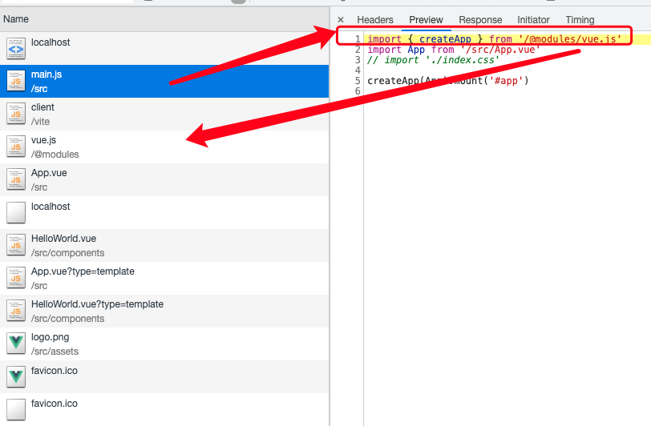
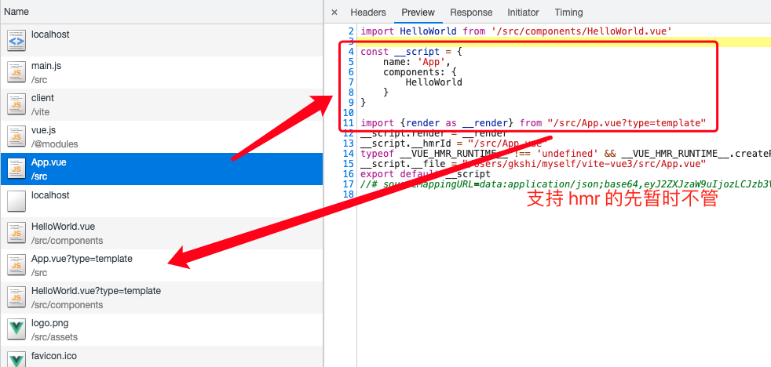
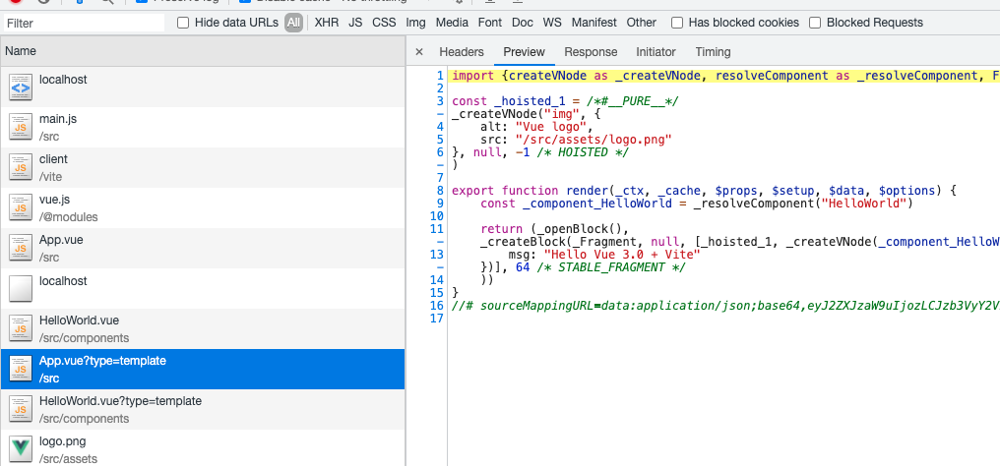

### Vite 1.x 核心原理学习项目

> 本项目为学习 Vite 1.x 原理时手写的几个核心功能的简化版实现，旨在了解 Vite 是如何做到随引随加载，无需每次打包的无感开发体验。
>
> 使用 Vite 1.x 版本学习出于以下原因：
>
> - 有比较成熟和完善的资料参考
> - 与 2.x 版本的实现思想本质一样
>
> 有些模块，如预优化、hmr 模块较为复杂，故没有手写实现。


#### 1. 项目启动

```shell
# 安装 vite 本身所需依赖
npm i # yarn

# 安装 vite-mini 所需依赖
cd (当前项目路径)/vite-mini

npm i # yarn

# 运行 vite 自身启动项目，查看它的请求过程，
# 对比验证自己写的 vite-mini 功能
# 项目根目录
npm run dev # yarn dev


# 运行手写的核心功能调试
# 项目根目录
npm run mini # yarn mini

# 如果有安装 nodemon
nodemon

```

`vite-mini`会在`4000`端口开启一个服务供预览对比。


#### 2. 实践过程

> 未特殊说明，vite 都指 vite 1.x 版本。

vite 的工作方式是通过浏览器原生支持 ESM 并且会发起网络请求获取包内容，所以 vite 会开启一个 koa 服务，拦截这些请求，做自己的处理后再返回给浏览器。

它的整个工作流程为：

1. 进行依赖预打包（项目引用到的`node_modules/`中的第三方包会进行预打包，将`cmd`和`umd`的格式都转换为`esm`）。
2. 拦截请求，重写文件并返回内容
3. 监控文件变更，然后通知浏览器更新(`hmr`)

##### 2.1 过程简述

- 依赖预打包：
  - 由于 vite 运行的基础就是基于 `esm`，如果依赖包不支持，那只有经过转换后才能实现。
  - 其次，由于一次`esm`的引入(`import xxx from 'xx'`)就会发一次网络请求，为了防止网络请求瀑布问题，预打包会将一些小的 `esm`包进行合并优化。
  - 存放在`node_modules/.vite`目录，供拦截请求加载第三方模块时读取。

- 拦截请求重写文件并返回内容：
  - 由于`esm`不支持裸模块的加载(类型：`import { createApp } from 'vue'`中的`vue`)，所以需要重写成`/@modules/vue`这种类型，使得浏览器识别。
  - 单文件组件`.vue`浏览器是不识别的，所以需要重写内容。
  - 其他一些方面的问题或考虑
- `hmr`：
  - 热替换功能，和热重载不同。


`vue-mini/`主要是过程二中的一些重点步骤实现，关于为什么需要文件重写，以及如何重写等。

##### 2.2 部分功能解析

```javascript
// vite-mini/src/index.js

// 以中间件的形式注册各个插件，结合洋葱模型，需要注意调用顺序
  const resolvePlugins = [
    moduleRewritePlugin,  // 模块路径的重写，vue -> /@modules/vue
    moduleResolvePlugin,  // 模块的解析加载，主要是如 vue 的这种第三方裸模块路径改为了 /@modules/xxx，需要解析加载对应内容
    vueCompilerPlugin,  // 解析 .vue 的 sfc 组件
    serveStaticPlugin  // 静态服务插件
  ]
  
  resolvePlugins.forEach(plugin => plugin && plugin(context))
```

这里插件注册的顺序机制比较重要，虽然是从上到下依次注册，但是由于``koa`洋葱模型的特点，部分功能的执行顺序反而是从下到上的。

这是为了解决一些模块的嵌套引用，比如 a 引用 b， b 引用 c ，它们的路径都要被该正确改写。


##### 2.3 学习与功能编写顺序

下图为 vite 请求的过程：



由此可知，编写插件过程应该为：

1. `serveStaticPlugin`：让浏览器能成功访问到`main.js`文件
2. `moduleRewritePlugin`：红框中的内容和实际`main.js`对比，发现裸模块`vue`的路径加了`/@modules`，所以要对文件内容进行重写
3. `moduleResolvePlugin`：重写路径的模块需要被正确找到并返回，所以需要模块解析插件




后面的请求发现，`App.vue`的内容也进行了重写，实际内容是通过`App.vue?type=template`获取的，并且内容也转换成了`js`内容。

所以我们在前面三个插件的基础上还需要：

4. `vueCompilerPlugin`：来解析`.vue`的单文件组件(sfc)


每个插件的作用顺序，也不难确定：

- 首先是`serveStaticPlugin`让文件顺利访问，
- 紧接着本应该是`moduleRewritePlugin`重写路径，然后给`moduleResolvePlugin`插件解析获取的，但由于解析出的文件内容可能还存在引用，又需要进行路径重写。所以索性就先尝试解析文件，如果碰到`a`模块路径需要改写，则改写路径，下一次请求再获取`a`模块内容
- 在`vueCompilerPlugin`对`.vue`文件进行解析的时候，它可能会引入第三方模块要进行路径改写，或者说引入的文件有改写好的模块需要解析，所以该插件的作用应该在`moduleResolvePlugin`和`moduleRewritePlugin`之前。


最终，插件的作用顺序为：

serveStaticPlugin -> vueCompilerPlugin -> moduleResolvePlugin -> moduleRewritePlugin


这与插件的注册顺序看上去并不一致，是因为插件在编写时是在`await next()`之后执行代码的，也就是在洋葱模型的从内层穿透到外层的过程中。


#### 3. 学习资料

1.[Vite Design](https://vite-design.surge.sh/guide/getting-start.html#%E5%89%8D%E7%BD%AE%E7%9F%A5%E8%AF%86%E7%82%B9)

2.[Vite 1.x 源码](https://github.com/vitejs/vite/tree/1.x)

3.[Vite 官网](https://cn.vitejs.dev/)

4.[b站视频](https://www.bilibili.com/video/BV1at4y1a7zi)

注：Vite Design 有介绍 vite 2.0 的一些变化点，`vite-mini/`的内容有根据第4点的 b站视频 调整，所以如果代码看不懂，也可以查看视频(有效总时长约 1:40:00 左右)